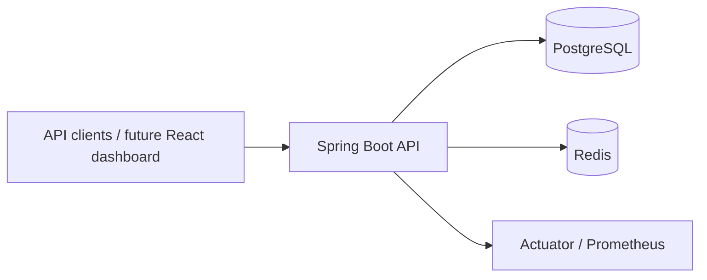
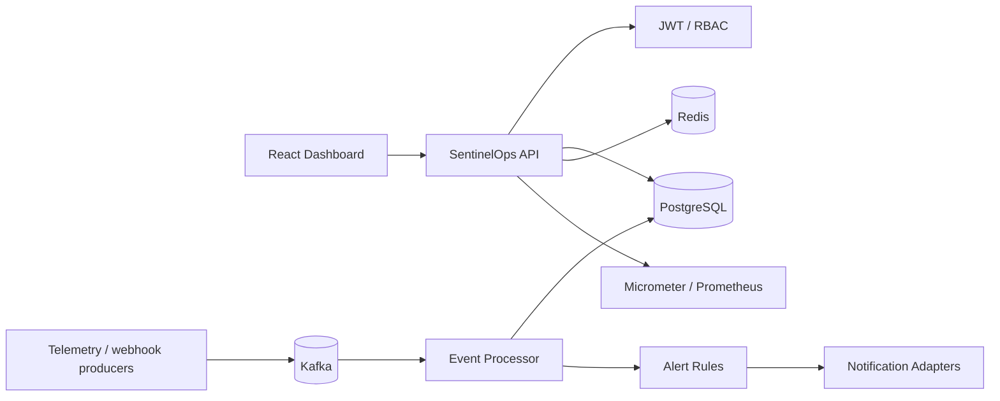

# SentinelOps architecture

## Current architecture

## Planned evolution

## Design goals

- Clear domain boundaries around services, incidents, events and alerts.
- Durable relational state in PostgreSQL.
- Asynchronous event processing for operational data.
- Redis for fast reads, distributed rate limiting and short-lived coordination.
- Auditable incident state transitions.
- Secure API access using JWT and role-based authorization.
- Observable by default through health probes, metrics and structured logging.
- Container-first local development and CI-friendly automated tests.
